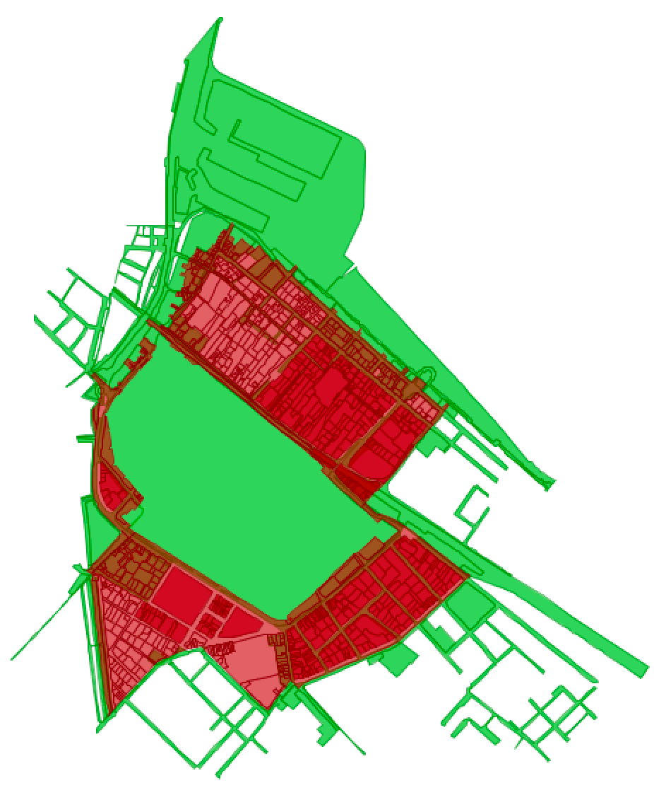

<a name="readme-top"></a>

[![Contributors][contributors-shield]][contributors-url]
[![Forks][forks-shield]][forks-url]
[![Stargazers][stars-shield]][stars-url]
[![Issues][issues-shield]][issues-url]
[![MIT License][license-shield]][license-url]
[![LinkedIn][linkedin-shield]][linkedin-url]

<!-- PROJECT LOGO -->
<br />
<div align="center">
  <a href="https://github.com/farzad-845/UNIPD_GIS_MASTER_PLAN">
    
  </a>
</div>


<!-- TABLE OF CONTENTS -->
<details>
  <summary>Table of Contents</summary>
  <ol>
    <li>
      <a href="#about-the-project">About The Project</a>
      <ul>
        <li><a href="#built-with">Built With</a></li>
      </ul>
    </li>
    <li><a href="#license">License</a></li>
  </ol>
</details>


<!-- ABOUT THE PROJECT -->
## About The Project
The primary objective of this project is to develop an advanced Geographic Information System (GIS) application tailored for the management and uti- lization of the Master Plan of the Italian province of Fano with a population of approximately 250,000 inhabitants, Fano’s Master Plan serves as a crucial blueprint for urban and territorial development. This project seeks to address the specific needs of planners and the general public, offering them a platform that facilitates the creation, maintenance, and accessibility of plan variants, thus fostering efficient urban planning and informed decision-making.

## Project Structure

### Main Structure
```bash
Agora
├── backend
│   ├── app
│   ├── Dockerfile
│   ├── Dockerfile.without_k8s
├── environment.env
├── docker-compose.yml
├── README.md

```
Inside the `app` folder we have the main application + the `initial_data.py` script that fetch the data from sitemap and fill the db with it, and the `pyproject.toml` file that contains the dependencies of the project.

### App Structure
```bash
App
├── app
│   ├── api
│   │   ├── v1 -> endpoint to get the data (content)
│   ├── core (contains config)
│   ├── crud (contains crud operations)
│   ├── db (used for init database & session management)
│   ├── models
│   ├── schemas
│   ├── utils
│   ├── initial_data.py (script to fetch data from sitemap and fill the db)
│   ├── main.py (main application)
├── pyproject.toml
├── poetry.lock
```
### Models
After adding models to the `models` folder you should create crud and schema for them in the `crud` and `schemas` folder respectively.

### Crud & Schemas
We have `base_crud.py` that contains the base crud operations that we can use for all models like `get_all`, `get_by_id`, `create`, `update`, `delete` and ... .
And if you need some specific crud operations for a model you can define the function in a crud file related to that model.


In schemas folder for each model we have three different schemas for each model:
- `IModelRead` that contains the fields that we can read from the model
- `IModelCreate` that contains the fields that we can create the model with
- `IModelUpdate` that contains the fields that we can update the model with, this one can use with decorator `@optional` to make the fields optional
- `IModel...` that match your needs

### API
In the `api` folder we have the endpoints that we can use to get the data from the db.

Define your endpoint as route under `router = APIRouter()` and write your function under it.

### main.py
Set up the application and add the routers to it. Also, we add middleware to the application to handle `CORS` and add the `db` to the application, this way we can use `db` in our endpoints without initializing session each time in each endpoint.

---
## How to run
### Docker
This command will build the image and run the container
```bash
docker-compose up --build
```
In command section of docker-compose.yml we have two commands:
- `python app/initial_data.py` to create the db and fill it with initial data that fetch from sitemap
- `uvicorn app.main:app --workers 5 --host 0.0.0.0 --port 8000` to run the server

#### Debugging and adding new code
For debugging or add new code to the project you can add `--reload` to the command to reload the server when you change the code in the command section of docker-compose.yml

```bash
command: bash -c "python app/initial_data.py && uvicorn app.main:app --reload --workers 5 --host --host 0.0.0.0 --port 8000`
```
But consider that when you add `--reload` to the command the `--workers` parameter will be ignored and the server will run with one worker.

#### Environment Variables
For adding environment variables to the docker-compose.yml or your application you can add them to the `environment.env` file in the root of the project.

### Built With

[![FastApi][FastApi]][FastApi-url]
[![OpenJump][OpenJump]][OpenJump-url]
[![GeoServer][GeoServer]][GeoServer-url]
[![Docker][Docker]][Docker-url]
[![PostgreSQL][PostgreSQL]][PostgreSQL-url]
[![Leaflet][Leaflet]][Leaflet-url]


<p align="right">(<a href="#readme-top">back to top</a>)</p>

#### Contributors
- Farzad Shami

<!-- LICENSE -->
## License

Distributed under the MIT License. See `LICENSE.txt` for more information.

<p align="right">(<a href="#readme-top">back to top</a>)</p>

<!-- MARKDOWN LINKS & IMAGES -->
<!-- https://www.markdownguide.org/basic-syntax/#reference-style-links -->
[contributors-shield]: https://img.shields.io/github/contributors/farzad-845/UNIPD_GIS_MASTER_PLAN.svg?style=for-the-badge
[contributors-url]: https://github.com/farzad-845/UNIPD_GIS_MASTER_PLAN/graphs/contributors
[forks-shield]: https://img.shields.io/github/forks/farzad-845/UNIPD_GIS_MASTER_PLAN.svg?style=for-the-badge
[forks-url]: https://github.com/farzad-845/UNIPD_GIS_MASTER_PLAN/network/members
[stars-shield]: https://img.shields.io/github/stars/farzad-845/UNIPD_GIS_MASTER_PLAN.svg?style=for-the-badge
[stars-url]: https://github.com/farzad-845/UNIPD_GIS_MASTER_PLAN/stargazers
[issues-shield]: https://img.shields.io/github/issues/farzad-845/UNIPD_GIS_MASTER_PLAN.svg?style=for-the-badge
[issues-url]: https://github.com/farzad-845/UNIPD_GIS_MASTER_PLAN/issues
[license-shield]: https://img.shields.io/github/license/farzad-845/UNIPD_GIS_MASTER_PLAN.svg?style=for-the-badge
[license-url]: https://github.com/farzad-845/UNIPD_GIS_MASTER_PLAN/blob/master/LICENSE.txt
[linkedin-shield]: https://img.shields.io/badge/-LinkedIn-black.svg?style=for-the-badge&logo=linkedin&colorB=555
[linkedin-url]: https://linkedin.com/in/farzad-shami
[product-screenshot]: images/screenshot.png
[FastApi]: https://img.shields.io/badge/fastapi-000000?style=for-the-badge&logo=fastapi&logoColor=white
[FastApi-url]: https://fastapi.tiangolo.com/
[Leaflet]: https://img.shields.io/badge/leaflet-199900?style=for-the-badge&logo=leaflet&logoColor=white
[Leaflet-url]: https://leafletjs.com/
[Docker]: https://img.shields.io/badge/docker-2496ED?style=for-the-badge&logo=docker&logoColor=white
[Docker-url]: https://www.docker.com/
[PostgreSQL]: https://img.shields.io/badge/postgresql-336791?style=for-the-badge&logo=postgresql&logoColor=white
[PostgreSQL-url]: https://www.postgresql.org/
[OpenJump]: https://img.shields.io/badge/openjump-66023C?style=for-the-badge&logo=openjump&logoColor=white
[OpenJump-url]: https://www.openjump.org/
[GeoServer]: https://img.shields.io/badge/geoserver-FF5E0E?style=for-the-badge&logo=geoserver&logoColor=white
[GeoServer-url]: https://geoserver.org/

---

<p><em>Part of Geographic Information Systems 2022-2023 course of <a href="http://www.unipd.it">University of Padova</a></em>